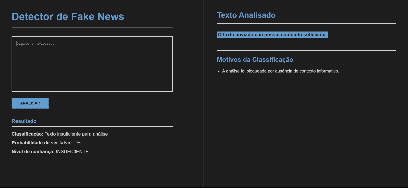

# Analisador e classificador de noticias falsas - BR

<p align="center">
  
  
  
  
</p>

<p align="center">
Sistema de detecção de Fake News em língua portuguesa utilizando <b>Aprendizado de Máquina</b>, <b>TF-IDF</b> e <b>Support Vector Machine (SVM)</b>.
</p>

---

## Desenvolvimento

Este projeto foi desenvolvido como Trabalho de Diplomação e tem como objetivo auxiliar usuários na identificação preliminar de notícias potencialmente falsas por meio da análise textual.

O sistema utiliza técnicas de:

- Processamento de Linguagem Natural (PLN)
- Vetorização TF-IDF
- Aprendizado de Máquina
- Support Vector Machine (SVM)
- Interface Web com Flask

A proposta não é substituir a verificação humana, mas atuar como uma ferramenta de apoio no combate à desinformação.

---



---

## Exemplo
O usuário insere uma notícia:

```text
O governo anunciou novas medidas econômicas...
```

O sistema retorna:

Possível Notícia Verdadeira

ou

Possível Fake News

Além disso:

- Exibe a confiança da classificação;
- Destaca palavras relevantes;
- Identifica conteúdo político;
- Apresenta possíveis motivos da classificação.

---


## Dataset

O projeto utiliza o **Fake.br Corpus**, um conjunto de dados em língua portuguesa desenvolvido pela Universidade de São Paulo (USP).

Características:

- Aproximadamente 7.200 notícias;
- Balanceado entre notícias verdadeiras e falsas;
- Conteúdo jornalístico em português.

---


## Interface

O sistema possui:

- Campo para inserção da notícia;
- Classificação automática;
- Percentual de confiança;
- Texto destacado;
- Explicação dos motivos da classificação;
- Detecção de conteúdo político.

---

## Instalação e Execução:

Clone o projeto:

```bash
git clone https://github.com/seuusuario/seurepositorio.git
```

Entre na pasta:

```bash
cd seurepositorio
```

Instale as dependências:

```bash
pip install -r requirements.txt
```

---

Execute:

```bash
python app.py
```

Depois abra:

```text
http://127.0.0.1:5000
```

---

## Estrutura a ser encontrada:

```text
├── app.py
├── modelo_fake_news.pkl
├── vectorizer.pkl
├── templates
│   └── index.html
├── static
│   └── style.css
├── dataset
│   └── Fake.br Corpus
├── requirements.txt
└── README.md
```

---

## Referências

Monteiro R.A., Santos R.L.S., Pardo T.A.S., de Almeida T.A., Ruiz E.E.S., Vale O.A. (2018) Contributions to the Study of Fake News in Portuguese: New Corpus and Automatic Detection Results. In: Villavicencio A. et al. (eds) Computational Processing of the Portuguese Language. PROPOR 2018. Lecture Notes in Computer Science, vol 11122. Springer, Cham

---
